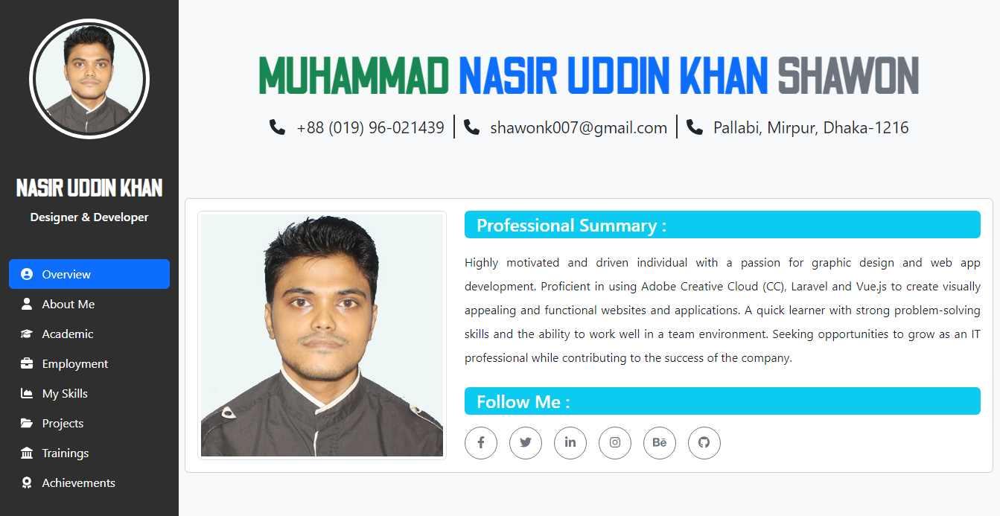

# Interactive Web Resume using Bootstrap

Explore my interactive resume GitHub repository, a dynamic and visually appealing static website showcasing my skills, experience, and projects. This project leverages a powerful tech stack, including HTML, CSS, Bootstrap, JavaScript, jQuery, and SASS to create an engaging online portfolio.

## Live Preview 

To preview this project please visit https://demo.shawon-khan.com/

## User Interface

## Technologies Used
The following technologies have been used in the creation of this UI:

- **[Bootstrap](https://getbootstrap.com/)** : A CSS framework for creating responsive and attractive UI components.
- **[FontAwesome](https://fontawesome.com/)**: A popular icon library that provides a wide range of icons for web projects.

## Key Features

- **Responsive Design**: The resume is designed to look great on all devices, from desktop to mobile, ensuring a seamless user experience.

- **Bootstrap Framework**: Built on top of the Bootstrap framework, the site incorporates responsive design components and a clean, modern layout.

- **Interactive Elements**: JavaScript and jQuery are used to add interactivity to the resume, such as smooth scrolling navigation, interactive progress bars, and dynamic content loading.

- **Custom Styling with SASS**: SASS (Syntactically Awesome Style Sheets) is employed to keep the CSS organized and maintainable, allowing for easy customization of colors, fonts, and styles.

- **Project Showcase**: Highlight your projects and achievements with a dedicated section, complete with images, descriptions, and links to GitHub repositories or live demos.

- **Skills Section**: Display your proficiency in various technologies and tools using eye-catching progress bars and icons.

- **Contact Information**: Provide multiple ways for potential employers or collaborators to get in touch with you, including email, social media links, and a contact form.

## License

This project is licensed under the `GNU General Public License version 3.0 (GPL-3.0)`. You can find the full text of the license in the `LICENSE` file.

## Author

`Interactive Web Resume` is designed and maintained by **[Muhammad Nasir Uddin Khan Shawon](https://www.shawon-khan.com/)**. You can find more about me on my [GitHub profile](https://github.com/shawonk007). Feel free to reach out via email at `shawonk007@gmail.com` or connect with me on **[LinkedIn](https://www.linkedin.com/in/shawonkhan007)**.